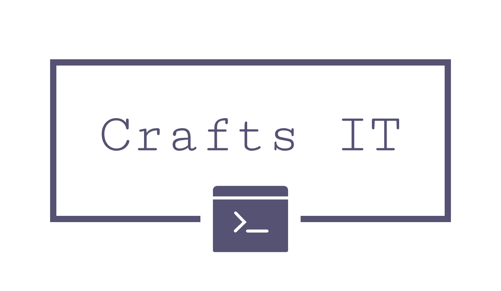

# Crafts-IT Website

Static website for Crafts-IT hosted on GitHub Pages.

## 🎨 Quick Content Editing Guide

### Editing Text Content

The website uses a simple template system. To update content:

#### 1. **Home Page** (`index.html`)
Edit this file to change:
- Hero banner text ("IT Solutions Made Simple")
- Service cards (IT Onsite Service, Cloud Solutions, Cybersecurity)
- Service descriptions

**Example:**
```html
<div class="service-card">
    <h3>Your Service Name</h3>
    <p>Your service description here.</p>
</div>
```

#### 2. **Imprint/Impressum** (`imprint.html`)
Update your legal company information here.

#### 3. **Privacy Policy/Datenschutz** (`datenschutz.html`)
Update your privacy policy text here.

#### 4. **Navigation & Footer** (`layout.html`)
Edit this file to change:
- Logo
- Navigation menu links
- Footer text and links
- Cookie banner text

### Changing Colors

All colors are defined in `styles/style.css`:

**Brand Colors (currently used):**
- Primary Blue: `#545B7B` (logo color)
- Light Blue: `#8B92B5` (accents)
- Dark Blue: `#3E4255` (hover states)

To change colors, search for these hex codes in `style.css` and replace them.

### Changing the Logo

1. Replace `assets/logo_transparent.png` with your new logo file
2. Keep the same filename, or update the path in `layout.html`:
   ```html
   
   ```
3. Adjust logo size in `styles/style.css` (search for `.logo-img`)

## 🛠️ Building the Website

### Option 1: Using PowerShell (Windows)

**Build only:**
```powershell
.\build.ps1
```

**Build and preview locally:**
```powershell
.\build.ps1 -Mode preview
```

The preview will start at `http://localhost:4173`

### Option 2: Using Node.js

If you have Node.js installed:

```bash
npm run build          # Build only
npm run preview        # Preview built site
npm run dev           # Build and preview
```

### How the Build Works

1. **Template Injection:** Content from `index.html`, `imprint.html`, and `datenschutz.html` is injected into `layout.html`
2. **Output:** Built files are placed in the `dist/` folder
3. **Assets:** All files from `assets/`, `styles/`, and `scripts/` are copied to `dist/`

## 📁 File Structure

```
Crafts-it.de/
├── index.html          # Home page content
├── imprint.html        # Impressum content
├── datenschutz.html    # Privacy policy content
├── layout.html         # Site template (header, footer, navigation)
├── assets/             # Images and media files
│   └── logo_transparent.png
├── styles/
│   └── style.css       # All visual styling
├── scripts/
│   └── main.js         # Cookie banner and year display
├── build.js            # Node.js build script
├── build.ps1           # PowerShell build script (works without Node)
├── preview.js          # Local preview server
└── dist/               # Built website (deploy this folder)
```

## 🚀 Deployment to GitHub Pages

### Automatic Deployment

1. **Commit your changes:**
   ```bash
   git add .
   git commit -m "Update website content"
   ```

2. **Build the site:**
   ```powershell
   .\build.ps1
   ```

3. **Push to GitHub:**
   ```bash
   git push origin dev
   ```

4. **Merge to main branch** (GitHub Pages serves from `main` or `dist/`)

### Manual Deployment

After building, the `dist/` folder contains the complete static website ready for deployment.

## 📝 Editing Workflow

### For Non-Programmers

1. **Open the files in VS Code or any text editor**
2. **Edit the HTML text between tags:**
   - `<h2>Your Text Here</h2>` → Headings
   - `<p>Your Text Here</p>` → Paragraphs
3. **Save the file**
4. **Run build script** (see Building section above)
5. **Preview locally** before deploying

### For Programmers

- Direct file editing
- Standard Git workflow
- Build pipeline handles template injection and asset copying
- Static output: no server-side processing needed

## 🎯 Common Tasks

### Add a New Service Card

In `index.html`, add within the `services-grid` div:

```html
<div class="service-card">
    <h3>New Service Name</h3>
    <p>Service description goes here.</p>
</div>
```

### Change Hero Text

In `index.html`, find the `.hero` section:

```html
<div class="hero">
    <h2>Your Main Headline</h2>
    <p>Your tagline or description.</p>
</div>
```

### Update Footer Year

This is automatic! The year updates via JavaScript in `scripts/main.js`.

### Modify Cookie Banner Text

In `layout.html`, find `#cookie-banner`:

```html
<p>Your cookie notice text here.</p>
```

## 🔧 Technical Details

- **No dependencies:** Runs with PowerShell 5.1+ or Node.js
- **Static output:** Pure HTML/CSS/JS, no build tools needed in production
- **GitHub Pages compatible:** All output is static
- **Fonts:** Uses system fonts (no external dependencies)
- **No tracking:** Cookie banner for compliance, localStorage for preference

## 📞 Support

For questions about editing this website, see the examples above or contact your web administrator.

---

**License:** Private use for Crafts-IT
